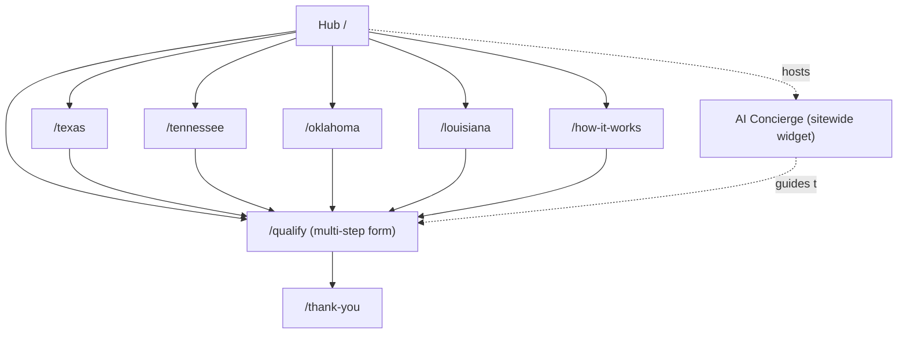
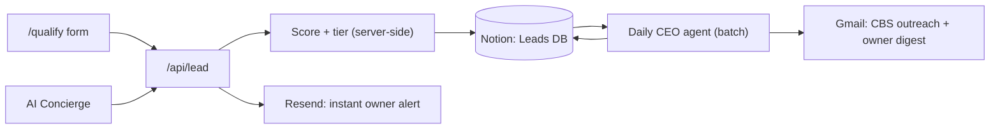

# BarndoBuilt — Lead-Gen Funnel: Site Architecture, Lead Pipeline & Autonomous CEO

## Context

We are building a lead-generation business that captures rural landowners in TX/TN/OK/LA
who want to build custom barndominiums, then sells those qualified leads to Complete Barndo
Solutions (CBS) — and, later, to other builders. The copy stack and a daily autonomous "CEO"
agent already exist (routine `trig_01Hzz7YTK4dBufyZqTz3xFFs`).

What's missing is the actual machine: a website to capture leads, a paginated qualification
form, an AI concierge to guide visitors, a wired data pipeline so leads flow into a place the
CEO agent can act on, and CEO decision-timeframe controls so the business runs itself.

This plan covers the whole build. There is no existing codebase — clean greenfield.

---

## CEO Decisions Made (per "I trust your decisions")

| Decision | Call | Reasoning |
|----------|------|-----------|
| Branding | **Neutral own brand: "BarndoBuilt"** | No CBS agreement signed yet — cannot present as their official site (legal risk). A neutral brand also lets us sell leads to multiple builders later. |
| Site model | **Hub = primary market + state landing pages** | Hub targets rural landowners (our chosen segment); 4 state pages split geography for ad relevance + A/B funnel testing. |
| Domain | **`barndobuilt.vercel.app` (Vercel subdomain)** | Per your choice — launch fast, free, attach a real domain once leads flow. |
| SEO scope | **Launch with hub + 4 state pages; CEO agent decides expansion** | County/metro programmatic pages are a Day-21 decision in the CEO Decision Calendar, gated on real CPL + organic data. |
| Stack | **Next.js 15 (App Router) + TypeScript + Tailwind, deployed to Vercel** | Greenfield, no conventions to inherit. Vercel connector already available. |
| Lead store | **Notion "Leads" database** | The CEO agent already reads Notion via MCP — Notion is the bridge between the website and the autonomous agent. |
| Instant alerts | **Resend (transactional email)** | Free tier, clean Next.js integration. Gmail connector stays for the CEO daily digest. |
| Chatbot model | **claude-sonnet-4-6 + prompt caching** | Concierge quality matters; caching keeps cost low. |
| "/batch" | Interpreted as the **daily lead-processing batch pipeline** (score → tier → batch-deliver). No `/batch` skill exists — this is the intent. |
| "paginated" | Interpreted as the **multi-step paginated qualification form** + the paginated state-page structure. |

---

## 1. Site Architecture

### Page Hierarchy

```
BarndoBuilt Home / Hub (/)              ← primary market: rural landowners
├── Texas        (/texas)               ← state landing page
├── Tennessee    (/tennessee)
├── Oklahoma     (/oklahoma)
├── Louisiana    (/louisiana)
├── Qualify      (/qualify)             ← multi-step paginated form
│   └── ?state=tx|tn|ok|la              ← prefill from state pages
├── Thank You    (/thank-you)           ← post-submit, sets expectations
├── How It Works (/how-it-works)
├── Privacy      (/privacy)
└── Terms        (/terms)
```

Phase 2 (CEO-gated expansion): segment pages `/veterans`, `/landowners`, `/ag-families`
for A/B funnel testing; programmatic `/barndominium-builder/[state]/[county]` pages.

### Visual Sitemap



### URL Map

| Page | URL | Nav | Priority |
|------|-----|-----|----------|
| Hub | `/` | Logo home | High |
| State pages | `/texas` `/tennessee` `/oklahoma` `/louisiana` | Ad landing | High |
| Qualify form | `/qualify` | Primary CTA target | High |
| Thank You | `/thank-you` | Post-submit only | High |
| How It Works | `/how-it-works` | Header + footer | Medium |
| Privacy / Terms | `/privacy` `/terms` | Footer | Low |

### Navigation Spec

- **Header (minimal — funnel discipline):** Logo (→ `/`) + single CTA button "Check If You Qualify" (→ `/qualify`). No multi-item nav — every extra link is a leak.
- **Footer:** Brand line, How It Works, Privacy, Terms, contact email. Nothing else.
- **The chatbot is the real navigation** — it guides, explains, and routes visitors to `/qualify`.
- **No breadcrumbs** — the site is intentionally 1 level deep for conversion.

---

## 2. Multi-Step Paginated Qualification Form (`/qualify`)

Client-side wizard, one question-group per step, progress bar, partial-progress saved to
`localStorage`. Easiest/lowest-commitment question first; contact info LAST.

| Step | Content | Purpose |
|------|---------|---------|
| 1 | **State** (TX/TN/OK/LA/Other) | Fail-fast disqualifier + low-friction first click. "Other" → soft exit. |
| 2 | **Land ownership** + **acreage** | Core qualifier (+30 own / +20 financing). |
| 3 | **Timeline** + **build stage** | Intent scoring (+25 if ≤12mo). |
| 4 | **Budget range** | Tier signal (+20 if $150k+). |
| 5 | **Contact info** (name, phone, email, best time) | Captured only after investment in steps 1–4. |

On submit → `POST /api/lead`. Validation: `react-hook-form` + `zod`. Scoring runs server-side
(single source of truth) using the existing rubric.

---

## 3. AI Concierge Chatbot (sitewide)

A persistent widget (bottom-right, every page) that behaves like a knowledgeable showroom
employee — explains barndominiums, financing, the build process, typical costs, and answers
anything, then guides the visitor into `/qualify`.

- **Endpoint:** `POST /api/chat` (Next.js route handler, streaming).
- **Model:** `claude-sonnet-4-6`, streamed responses.
- **Prompt caching:** system prompt + knowledge base cached (`cache_control`) — most turns hit
  cache, keeping cost low. Built per the `claude-api` skill.
- **Knowledge base:** `lib/concierge-knowledge.md` — barndo facts, financing (construction-to-perm
  loans), build timeline, cost ranges, FAQ, the BarndoBuilt value prop. Injected into cached system prompt.
- **Lead capture path:** the concierge can collect qualifying info conversationally and POST to
  the same `/api/lead` endpoint — it is a second funnel, tagged `source: concierge`.
- **Tone:** helpful expert, never pushy; proactively offers help after ~20s idle.

---

## 4. Lead Pipeline — "Wired" + the Batch ("/batch")



**Real-time (per submission):** form/concierge → `/api/lead` → score + assign tier → write row
to Notion Leads DB (`status: New`) → fire instant Resend email to owner.

**Daily batch (CEO agent — the "/batch"):** reads all `status: New` leads → re-scores → sets
tier → updates `status: Scored-A | Scored-B | Nurture` → batches Tier A+B into a delivery set →
drafts/sends CBS outreach → logs to Notion → emails owner digest.

**Notion "Leads" database schema:** Name, State, Land Status, Acreage, Timeline, Build Stage,
Budget, Score, Tier, Status, Source (form/concierge + A/B variant), Submitted At, Notes.

---

## 5. A/B Testing

- **Bucketing:** Vercel middleware sets a `variant` cookie (50/50), persisted per visitor.
- **What we test first:** hub headline (Variation 1 vs 2 from the copy stack), and funnel path
  (form-first CTA vs concierge-first CTA).
- **Measurement:** the `variant` is written to each lead's Notion `Source` field, so the CEO
  agent computes conversion-by-variant in the daily batch and calls winners on a timeframe.
- Build follows the `ab-test-setup` skill.

---

## 6. CEO Agent Upgrade — Decision Calendar & Timeframe Controls

The existing routine (`trig_01Hzz7YTK4dBufyZqTz3xFFs`) gets a rewritten prompt adding a
**Decision Calendar**: each standing decision has a trigger day, the data it needs, and a
**default action if no human input by the deadline** — so the business never stalls.

| Campaign Day | Decision | Default if no input |
|--------------|----------|---------------------|
| 1–3 | Site live, concierge live, ads drafted | Proceed |
| 7 | Meta CPL acceptable? | If CPL > $40, shift targeting + flag owner |
| 10 | CBS agreement in motion? | If no reply, send follow-up Email B |
| 14 | A/B headline winner | Auto-promote higher-converting variant |
| 21 | SEO expansion (county pages) yes/no | If organic impressions thin → add 4 metro pages only |
| 30 | Scale / hold / pivot | Hold spend flat, full review email to owner |

The agent tracks campaign day-count from Notion, knows its phase, and surfaces only genuine
human decisions — everything else it executes.

---

## 7. Build Phases & File Structure

Project location (proposed): **`C:\Users\greg\Documents\BarndoBuilt`**

```
BarndoBuilt/
├── app/
│   ├── layout.tsx              (shell + concierge widget mount)
│   ├── page.tsx                (hub)
│   ├── [state]/page.tsx        (texas/tennessee/oklahoma/louisiana — data-driven)
│   ├── qualify/page.tsx        (multi-step form)
│   ├── thank-you/page.tsx
│   ├── how-it-works/page.tsx
│   ├── privacy|terms/page.tsx
│   └── api/
│       ├── lead/route.ts       (score + Notion write + Resend alert)
│       └── chat/route.ts       (streaming Claude concierge)
├── components/  (Header, Footer, QualifyWizard, ConciergeWidget, StateHero…)
├── lib/         (scoring.ts, notion.ts, states.ts, concierge-knowledge.md)
├── middleware.ts (A/B variant cookie)
└── .env.local
```

- **Phase 0** — Scaffold Next.js + Tailwind, deploy skeleton to Vercel.
- **Phase 1** — Hub + 4 state pages (copy from existing stack), Header/Footer.
- **Phase 2** — Multi-step form, `/api/lead`, scoring, Notion write, thank-you page.
- **Phase 3** — AI concierge widget + `/api/chat` + knowledge base.
- **Phase 4** — Resend instant alerts + A/B middleware.
- **Phase 5** — Rewrite CEO agent prompt with the Decision Calendar.
- **Phase 6** — Deploy to `barndobuilt.vercel.app`, end-to-end verification.

Hero/section imagery generated via the `image` skill in Phase 1.

---

## 8. What I Need From You (connections / data / keys)

Required before the relevant phase can be verified:

1. **Anthropic API key** → `.env.local` as `ANTHROPIC_API_KEY` (Phase 3 — concierge).
2. **Notion Leads database** — I will guide you to create an internal Notion integration and a
   "Leads" database; you provide `NOTION_TOKEN` + `NOTION_LEADS_DB_ID` (Phase 2). The same DB
   must be shared with your Notion MCP connector so the CEO agent can read it.
3. **Resend API key** → `RESEND_API_KEY` + a verified sender address (Phase 4 — free tier fine).
4. **Confirm project path** — `C:\Users\greg\Documents\BarndoBuilt` (or tell me otherwise).
5. **Brand name** — proceeding as "BarndoBuilt"; say the word to override.

Not needed for the build (later, for traffic): Meta Business Manager + Google Ads accounts.

---

## 9. Verification (end-to-end)

1. `npm run dev` — hub + all 4 state pages render, CTAs route to `/qualify`.
2. Complete the multi-step form → confirm a scored, tiered row appears in the Notion Leads DB
   and an instant Resend email arrives.
3. Open the concierge → ask barndo/financing questions → confirm streaming answers and that a
   concierge-captured lead also lands in Notion tagged `source: concierge`.
4. Load the site twice in different sessions → confirm the `variant` cookie splits and the
   variant is recorded on the lead row.
5. Manually run the CEO routine → confirm it reads the new Notion leads, scores/batches them,
   and produces the daily digest.
6. `vercel deploy` → confirm `barndobuilt.vercel.app` is live and the full flow works in prod.
